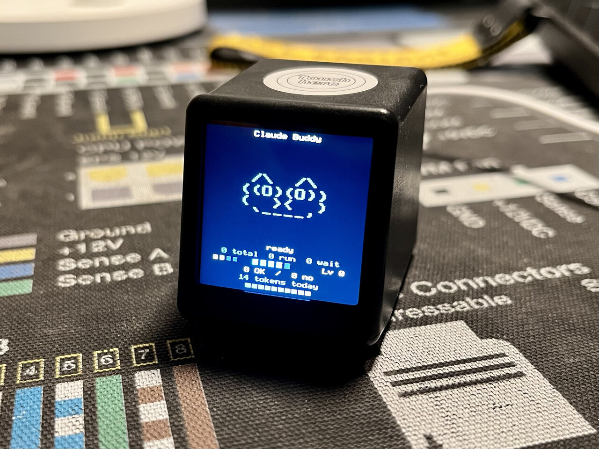

# Claude Buddy for GeekMagic Pro

A Claude desktop companion firmware for the [GeekMagic Pro](https://geekmagic.com/products/geekmagic-ultra)
(also sold on AliExpress for around $15). The device pairs with the
Claude desktop app over BLE in developer mode, displays your
sessions as an animated ASCII pet, and lets you approve or deny
permission prompts from the device itself.



The BLE wire protocol and ASCII pet art are taken from Anthropic's
[`anthropics/claude-desktop-buddy`](https://github.com/anthropics/claude-desktop-buddy)
reference firmware. This codebase is a separate ESP-IDF v6.0.1
implementation for different hardware (the GeekMagic Pro instead of
the M5StickC Plus).

## What it does

Once paired with a Claude desktop in developer mode (Help →
Troubleshooting → Enable Developer Mode → Developer → Open Hardware
Buddy), the device receives newline-delimited JSON heartbeats over a
Nordic UART Service link. It parses them into a session snapshot and
derives a persona state:

| State      | Trigger                          |
|------------|----------------------------------|
| sleep      | no desktop connected             |
| idle       | connected, nothing urgent        |
| busy       | three or more sessions generating |
| attention  | a permission prompt is waiting   |
| celebrate  | leveled up (every 50K tokens)    |

When a permission prompt arrives the device shows the tool name and
a truncated command preview. Tap the touch pad to approve, double
tap to deny. The decision goes back over the same BLE link.

The persona screen also displays a 3-line scrollable transcript (tap
to step back through history), session counts, mood and energy
gauges, approvals / denials, tokens today, and a fed-progress bar.

## Hardware

The chip is an ESP32-D0WD-V3 (rev v3.1) with 16MB GigaDevice flash.

| GPIO | Function                              |
|------|---------------------------------------|
| IO2  | Display DC                            |
| IO4  | Display reset                         |
| IO18 | SPI CLK                               |
| IO23 | SPI MOSI                              |
| IO25 | Backlight (inverted, LOW = on)        |
| IO32 | Capacitive touch (channel 9)          |

Display is a ST7789V 240x240 IPS, SPI mode 3 at 20MHz, with the
panel inversion bit enabled. There is no IMU, no battery PMIC, no
hardware RTC, and the case has no exposed buttons.

## Input model

One touch pad provides three gestures. The interpretation depends
on which screen is showing:

| Context           | TAP               | DOUBLE TAP    | LONG PRESS |
|-------------------|-------------------|---------------|------------|
| Permission prompt | approve           | deny          | menu       |
| Persona home      | scroll transcript | (reserved)    | menu       |
| Menu              | next item         | activate item | close menu |
| Info / confirm    | (no effect)       | back to menu  | back       |

## Build and flash

ESP-IDF v6.0.1 is required. Source the environment in every new
shell:

```sh
source /opt/esp-idf/export.sh
idf.py build
idf.py -p /dev/ttyUSB0 flash monitor
```

Or as a one-liner from outside a sourced shell:

```sh
bash -c "source /opt/esp-idf/export.sh && idf.py build"
```

The build produces `build/ClaudeBuddy.bin`.

You can also grab a prebuilt `ClaudeBuddy.bin` without setting up
the toolchain:

* Latest stable build (always points at the newest release):
  [`ClaudeBuddy.bin`](https://github.com/annoyedmilk/magicgeek-buddy/releases/latest/download/ClaudeBuddy.bin)
* All releases with notes: [Releases page](../../releases)

Either flash it manually the first time, or push it via OTA if the
device is already running a previous version.

### First flash (GPIO0 + RST dance)

The GeekMagic Pro has no exposed BOOT or RST buttons and is flashed
via a bare FTDI with no auto-reset wiring. **Flashing at your own
risk.** To enter the ROM bootloader:

1. Hold a jumper between GPIO0 and GND.
2. Briefly tap RST to GND, then lift RST.
3. Keep GPIO0 grounded for around two seconds after releasing RST.
4. Lift GPIO0. Run esptool or `idf.py flash` within its connect-wait
   window.

After the first flash, all subsequent updates go over WiFi via the
browser OTA page. The jumper dance is a one-time thing.

### OTA updates after the first flash

Once the device is connected to your WiFi, open
`http://<device-ip>/ota` in a browser. Drag a fresh
`ClaudeBuddy.bin` onto the upload area, click Upload, and the
device reflashes itself and reboots. The bootloader has rollback
support, so a bad image reverts on next boot rather than bricking.

The same page has a Danger Zone with a Factory Reset button: type
`RESET` in the confirm field, hit the button, and the device wipes
stats, settings, WiFi creds, and BLE bonds before rebooting into
captive-portal mode.

## First boot user flow

On a freshly flashed device with no saved WiFi:

1. Device shows the WIFI SETUP screen with a SoftAP name like
   `Buddy-C1C9` and the IP `192.168.4.1`.
2. Connect a phone or laptop to that AP. On most platforms the
   captive portal sheet opens automatically. If not, browse to
   `192.168.4.1`.
3. Enter your WiFi SSID and password on the Claude-themed page. The
   device saves them, reboots, and joins your network.
4. Once online, the screen shows the device IP and asks you to pair
   via Bluetooth from the Claude desktop app.
5. In Claude desktop, open Developer → Hardware Buddy, click
   Connect, and pick the device named `Claude-XXXX` (last four hex
   of the BT MAC).
6. The device shows a six-digit passkey. Type it on the desktop
   side. Bonding is persisted in NVS, so reconnects skip the prompt.

After pairing, the home screen shows the active persona with an
ASCII pet animation and the data stack underneath.

## Menu

Long press opens the menu overlay.

| Item          | What it does                                  |
|---------------|-----------------------------------------------|
| next pet      | cycles through the 18 ASCII species, persists |
| info / about  | device identity, Claude link, WiFi, RSSI      |
| factory reset | wipes stats, settings, WiFi creds, BLE bonds  |
| close         | dismisses the overlay                         |

Factory reset uses a two-step confirm with a five-second countdown.

## Architecture

```
main/
  main.c              boot, render loop, screen selection, touch routing
  display.c/.h        ST7789V raw SPI plus GPIO25 backlight (LEDC PWM)
  framebuffer.c/.h    240x120 banded RGB565 buffer (~58KB), 2 pass flush
  gfx.c/.h            8x8 font and primitives that compose into the FB
  touch_button.c/.h   tap, double tap, long press detection
  storage.c/.h        NVS key value wrapper
  wifi_manager.c/.h   STA, captive portal, shared HTTP server
  ble_nus.c/.h        NimBLE Nordic UART Service with LE Secure bonding
  bridge.c/.h         cJSON heartbeat parsing, command dispatch
  stats.c/.h          NVS backed stats, settings, owner, level math
  buddy.c/.h          ASCII pet registry, drawing primitives
  buddies/*.c         18 species, one file each
  ui.c/.h             menu, info, factory reset confirm overlays
  ota_server.c/.h     Claude themed browser OTA on the shared httpd
```

The home screen runs in `buddy_task` (its own FreeRTOS task with an
8KB stack). `app_main` does init then returns, which avoids the
Task Watchdog tripping on a long first draw.

Compose callbacks pass through `fb_frame()`, which invokes the
callback once per band and flushes each band as a single DMA SPI
blit. This replaces the per-primitive blocking transmits that would
risk interrupt watchdog problems on heavy frames.

Touch routing gives the UI module first refusal on every gesture.
Only gestures the UI did not consume fall through to the bridge for
permission approve or deny (or to the transcript scroller on the
persona screen).

## Protocol

The BLE wire format follows the Hardware Buddy spec from the
reference project. Implemented commands:

| Command          | Direction        | Implementation             |
|------------------|------------------|----------------------------|
| heartbeat        | desktop > device | bridge.c apply_heartbeat   |
| status           | desktop > device | bridge.c ack_status        |
| name             | desktop > device | bridge.c, persisted in NVS |
| owner            | desktop > device | bridge.c, persisted in NVS |
| unpair           | desktop > device | bridge.c, ble_clear_bonds  |
| char_begin       | desktop > device | rejected with "unsupported" |
| permission       | device > desktop | touch handler on prompt    |
| status response  | device > desktop | sec, sys, stats blocks     |

GIF character packs (the `char_begin` / `file` / `chunk` family in
the reference spec) are not supported on this hardware. The
endpoints exist and ack with an explicit "not supported" error so
the desktop shows a clean rejection toast instead of timing out.

## Build numbers

Binary size around 1,170 KB out of a 1,920 KB OTA slot (40% free).
Steady-state free heap with every subsystem coresident
(framebuffer, NimBLE host, bridge, captive portal, OTA server) is
around 50KB.

## License

MIT.
